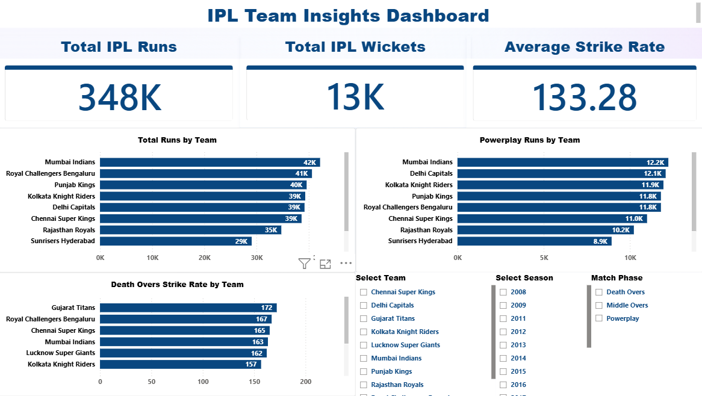
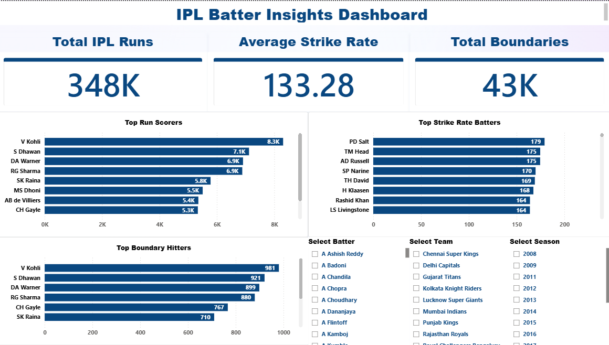
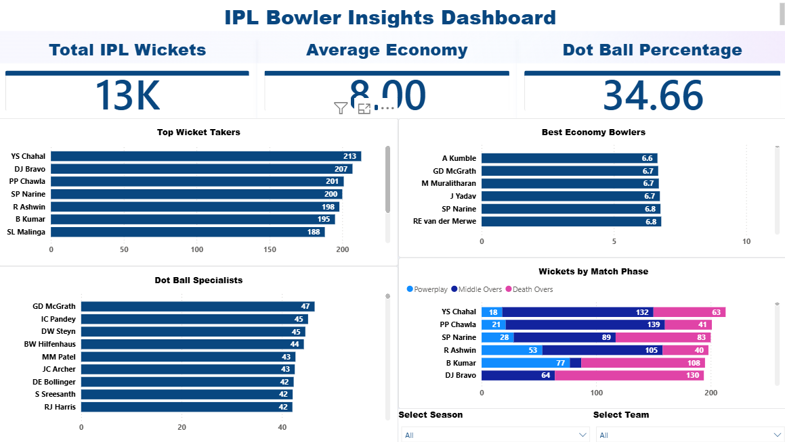

# IPL Analytics Dashboard

## Overview

This is an end-to-end IPL Analytics project built using SQL, Python, Pandas, Power BI, and DAX.

The project analyzes IPL team performance, batting insights, and bowling insights through interactive dashboards.

---

## Tech Stack

- SQL
- Python
- Pandas
- NumPy
- Jupyter Notebook
- Power BI
- DAX

---

## Project Workflow

Raw Data → Data Cleaning (Python) → SQL Analysis → Power BI Dashboard → Insights & Visualization

---

## Folder Structure

```
IPL-Analytics-Dashboard
│
├── dashboard/
├── data/
│   ├── raw/
│   └── processed/
├── notebooks/
├── outputs/
├── screenshots/
├── sql/
└── README.md
```

---

## Team Insights Dashboard



---

## Batter Insights Dashboard



---

## Bowler Insights Dashboard



---

## Key Insights

### Team Analysis
- Mumbai Indians lead total IPL runs.
- Strong powerplay performance drives team success.
- Death-over scoring significantly impacts match outcomes.

### Batter Analysis
- Virat Kohli leads overall run scoring.
- Strike rate highlights explosive batters.
- Boundary percentage reveals attacking intent.

### Bowler Analysis
- YS Chahal is among the leading wicket-takers.
- Sunil Narine excels in economy rate.
- Dot-ball specialists create sustained pressure.

---

## Author

Akshay P M

Aspiring Data Analyst | SQL | Python | Power BI | DAX
